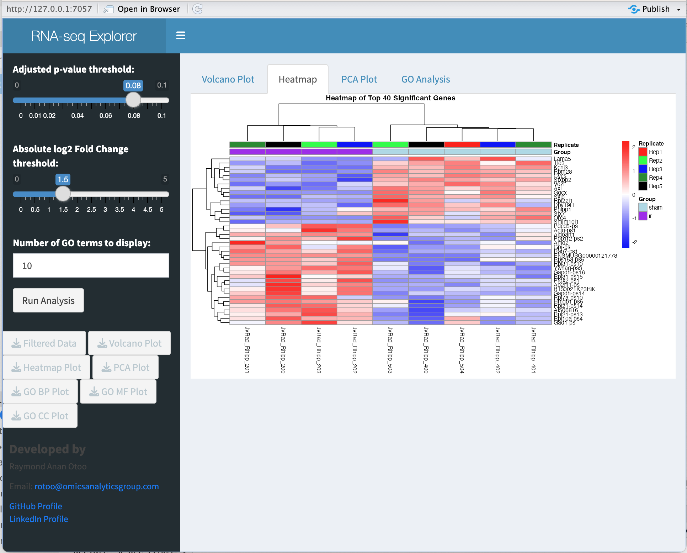

[](https://github.com/rayotoo/RNAseq-shiny-interactive/actions/workflows/r.yml)

# 🧬 RNA-seq Differential Expression Explorer (R Shiny App)

This R Shiny application provides an interactive interface for exploring RNA-seq differential expression results using DESeq2. It allows users to visualize and download key analysis outputs such as volcano plots, PCA, heatmaps, and Gene Ontology (GO) enrichment results.



---

## 🔧 Features

- **Run DESeq2** differential expression analysis interactively
- **Filter by adjusted p-value and log2 fold change**
- **Visualizations**:
  - Volcano plot
  - PCA plot (with sample labels)
  - Heatmap of top significant genes
- **GO Enrichment Analysis**:
  - Biological Process (BP)
  - Molecular Function (MF)
  - Cellular Component (CC)
- **Download options** for plots and tables

---

## 📁 File Structure

```text
RNAseq-shiny-interactive/
├── app.R               # Main Shiny app
├── final_counts.txt    # Count matrix from featureCounts
├── metadata_2.txt      # Metadata with sample groupings
├── README.md           # This file
